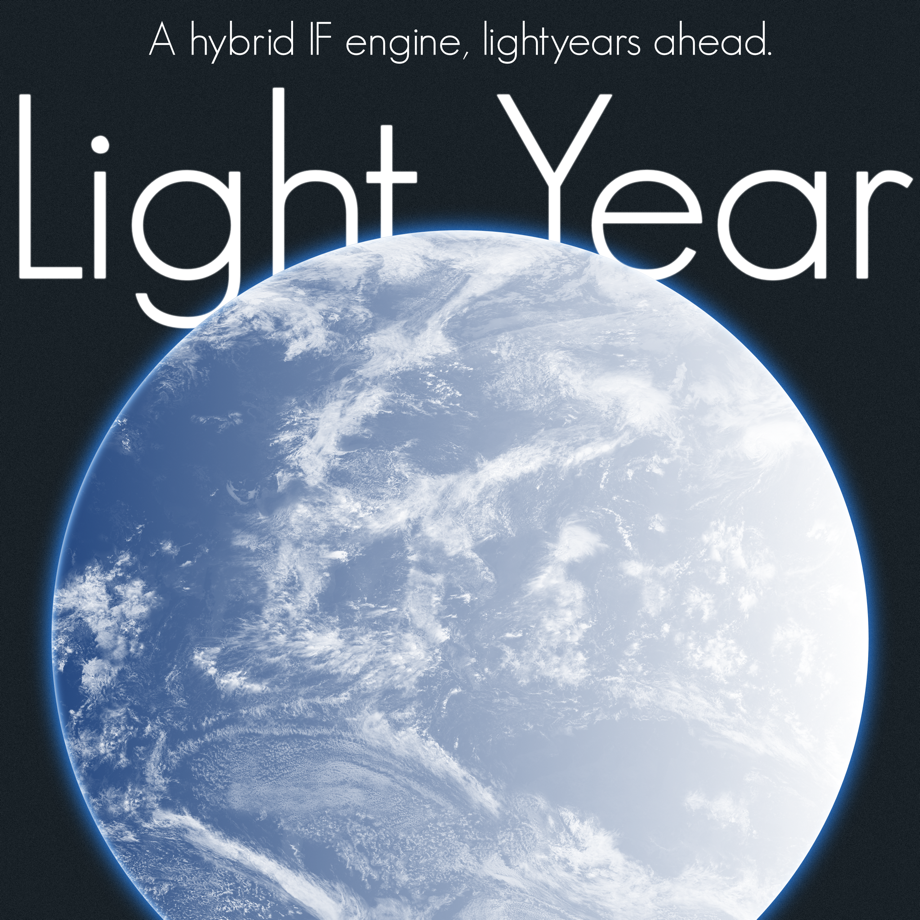

# Light Year
A hybrid IF engine, lightyears ahead.

We're working on a new class of interactive fiction engine– something modern, sleek, and empowering. Every human being is creative; everyone can tell stories, and technology should enhance their vision, not get in the way. The Light Year engine makes it very easy for *anyone* to create an immersive, enveloping interactive fiction, and provides a comprehensive API for experienced developers to create something truly unique. It is currently in development, please contact us for pre-release testing opportunities.

---
#0. Table of Contents
1. [What is 'IF'](#1-what-is-if)
	* a. [Example](#a-example)
	* b. [Explanation](#b-explanation)
	* c. [Advantages](#c-advantages)
2. [Play with Light Year](#2-play-with-light-year)
	* a. [What Makes Light Year Fun](#a-what-makes-light-year-fun)
	* b. [What Kind of Games to Expect](#b-what-kind-of-games-to-expect)
	* c. [Where to Find Games](#c-where-to-find-games)
	* d. [How to Play IF](#d-how-to-play-if)
3. [Develop with Light Year](#3-develop-using-light-year)
	* a. [Streamlined Development](#a-streamlined-development)
	* b. [Reach New Players](#b-reach-new-players)
	* c. [Why is Light Year Better than Other IF Engines](#c-why-is-light-year-better-than-other-if-engines)
	* d. [Technical Details](#d-technical-details)

---
#1. What is IF?
###a. Example
---

• • •

`go down`

*Step after step, you descend the cramped spiral-stairway, hearing only your solid leather boots striking the hard granite steps, and seeing little more. If it weren't for the moss occasionally felt along the cold, dull stone walls, it would seem like you're somehow stuck in a loop of the same left turn, and after ten minutes of this, a break might be nice.*

`go down`

*How much deeper could this stairway lead? After, what, another eight laps, you find yourself wishing to be at the bottom, whatever it takes. As if your wish is being granted, the stairway suddenly ends, leaving you with your nose pressed firmly against an old wooden door.*

`examine door`

*An exquisite show of craftsmanship, constructed with very old lumber, and finely brandished with an overly gaudy handle and key hole. You wonder if the door was made in these depths, or carried down. You'd hate to think of what happened to the porter, in the case of the latter.*

`open door`

*Suddenly, you hear a deep voice on the other side, and, startled, you pull your hand back. Would it be wise to barge in on this person?*

`listen at door`

*Curiosity gets a hold of you, and you stoop closer to the keyhole, hoping to make out the words.*

*"Yes, but what is IF?"*

*After a few moments of silence, the question is vocalized again: "What is IF?!".*

*This time, it's said with more emotion. Eventually, a sigh can be heard, although higher in pitch. There are two people beyond this door? I was told that no one had been down here in decades.*

*"How simple do I need to make this?", the higher-voice asks. "IF, like interactive fiction."*

*"So, you've said, but this doesn't make any sense. Fiction isn't something to be meddled with, surely, you're playing with the arcane!"*

*"Alright", replies the alto voice, clearly more agitated than when you first heard it. "Listen well, I shan't explain again".*

*However, in place of an explanation, the sound of hardened leather rapping on stone can be heard in quick succession, followed by ambient metal clatter.*

`look through keyhole`

*Your curious nature takes over once again, and you shift slightly, doing your best to keep silent while peering through the keyhole.*

*It would seem that fate is not on your side, however, as without warning, a loud crack echoes through the ancient halls. You fail to stifle a cry, feeling frayed strands tear across your back, leaving a throbbing trail in their wake. Panicked, you stumble forwards, tossing the door open in your rush, wishing only to escape the reach of your mysterious adversary.*

`*Enter Command*`

###b. Explanation
---

You get it now, right? No? Okay, here's the gist: interactive fiction is a story in which you are an active participant. In traditional cases, short passages of text will precede a text field. After reading, you'd decide on an action, type it, then repeat the cycle. How do you know what to type, you ask? Anything. Type anything. Really. What separates IF from other text-based entertainment is that as the reader, you get to define the story.

Does our hero check that cupboard before continuing onwards? Maybe they find a tin of beans. They examine the tin, and find it contains magical beans. A warning on the side prompts that they're prone to grow into a giant beanstalk. You- the hero- decide not to take the tin, and instead go south.

Or, maybe, you're a space captain, with a whole fleet at your disposal. However, are all of those ships- those people's lives- really yours to toss away? How would you face yourself after knowingly sending these brave soldiers to their doom? Surely, many innocent civilians will perish if you hold your soldiers back, but can you really justify this suicide mission? All I know is, your choices would probably lead to a resolution different from mine. The freedom in IF games can lead to very creative outcomes, some which you might not expect, and others which you may have worked very hard for.

Interactive fiction isn't about controlling a rogue mage in their magical tower, nor is it about making tough moral choices on the bridge of an A3-12 Falcon-class command ship, it's about exploring a new space, realizing yourself there, and seeing what kind of tale the author has in mind for you, and how you'll make it your own.

###c. Advantages
---

The best thing about IF as a genre, and Light Year as an engine, is that it allows anyone to craft a story, a game. No programming knowledge, modeling expertise, or level-design skills are required, and the turn around time is nearly immediate. Absolutely everyone has indulged their creativity at one time or another, pretending they were in a different situation, making up stuff as they went along. Developing an IF is just like that, although you might want to put a little planning into it.

We're being ambiguous about what can be created here on purpose. Sure, you can produce a dungeon to explore, replete with deviously trapped containers and trip wires at every other passage, or a a fully decked-out spaceship with hundreds of rooms, but you're not limited to those common tropes. Want to write a mystery about some little town near Arizona, USA, in which aliens have crashed? A horror adventure where the player is trapped in a snowed-in cabin? Or, how about a secondary school drama? Maybe a trilogy? Light Year gives you the tools to create whatever you can dream up, empowering you to let your imagination loose, share your games with the world, and experience new and unique situations, which are only possible through the medium of interactive fiction.

---
#2. Play with Light Year
(Section Incomplete)
###a. What Makes Light Year Fun
---
Main Points: Light Year is modern (has modern features, continuity). Light Year builds off of what makes older engines great (what you already love, and then some).

###b. What Kind of Games to Expect
---
Main Points: Unlimited possibilities; sci-fi, fantasy, modern, abstract, historical, steampunk, literally anything.

###c. Where to Find Games
---
Main Points: Find them on our website/forum (to be created), or anywhere around the web.

###d. How to Play IF
---
Main Points: Type your commands, role play, be immersed.

---
#3. Develop using Light Year
(Section Incomplete)
###a. Streamlined Development
---
Main Points: Develop using refined tools that let you focus on creating immersive stories. Everything you need in one place. Use included standard systems so all you have to do is write. Don't worry if you're new, our object-oriented design is logical, and simple.

###b. Reach New Players
---
Main Points: Use our localization system, and outsource translation to the community. Optionally distribute the client along with your game to make it easy for users (built-in update system means you don't *have* to worry about keeping up-to-date with the latest client releases).

###c. Why is Light Year Better than Other IF Engines
---
Main Points: Standardized systems, lower-level functions automatically taken care of, understandable format, access to API for more complex ideas, and simple, clear, object-oriented designer. Currently in development, doesn't carry years of 'old baggage', or ineffective systems for compatibility's sake.

###d. Technical Details
---
Main Points: Core written in C++, clients in native languages (Objective C, C#). API in C++. Git repo location (pro tip: you're already there), contributions welcome (get in touch before you submit a push request). Roadmap/Trello board.